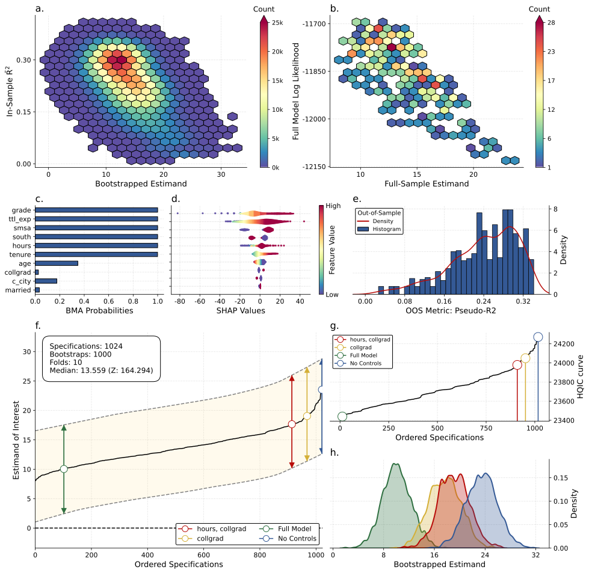

# Robustify Figure Interpretation Guide

> A concise, subfigure-by-subfigure guide for reading the standard Robustify results panel.

## Figure

---

## How to Read This Panel (Quick Orientation)

- The panel is designed to answer three questions: how strong are the estimates, how sensitive are they to specification choices, and which controls or features matter most.
- Subfigures (a–b) summarize model fit and full-sample behavior; (c–e) summarize feature importance and out-of-sample performance; (f–h) diagnose specification sensitivity and distributional stability.
- When highlights are enabled, the full model, null model, and any user-specified specifications are emphasized with distinct colors and markers across multiple panels to facilitate cross-panel comparison.

---

## Subfigure-by-Subfigure Interpretation

### a. In-Sample Fit vs Estimates (Hexbin)

*What you see.*  
A hexbin density of bootstrapped coefficient estimates plotted against in-sample R².

*How to read it.*
- The horizontal spread reflects variation in the estimand across resamples.
- The vertical spread reflects how fit quality varies with those estimates.
- Dense regions correspond to estimate–fit combinations that occur most frequently.

*What to look for.*
- A tight, well-defined cloud suggests stable estimates and consistent fit.
- A pronounced tilt or large vertical dispersion suggests dependence of the estimate on fit quality.

---

### b. Full-Sample Fit vs Estimates (Hexbin)

*What you see.*  
A hexbin plot of full-sample coefficient estimates versus log-likelihood.

*How to read it.*  
Interpretation parallels panel (a), but with a full-sample fit metric rather than a cross-validated one.

*What to look for.*
- Whether stronger or weaker estimates systematically coincide with better log-likelihood.
- Evidence of multimodality, which may indicate clusters of specifications with qualitatively different behavior.

---

### c. BMA Inclusion Probabilities

*What you see.*  
Horizontal bars showing Bayesian Model Averaging inclusion probabilities for each control.

*How to read it.*  
Longer bars indicate controls that appear more consistently across high-performing specifications.

*What to look for.*
- A small set of controls with high inclusion probabilities suggests a stable core specification.
- A relatively flat profile indicates substantial model uncertainty regarding which controls matter.

---

### d. SHAP Values (Beeswarm with Feature Value Coloring)

*What you see.*  
A beeswarm plot of SHAP value distributions per feature, colored by feature value (low to high).

*How to read it.*
- Horizontal dispersion reflects the magnitude and variability of a feature’s contribution.
- The color gradient indicates whether higher feature values tend to increase or decrease the estimate.

*What to look for.*
- Wide spreads indicate strong but heterogeneous influence.
- Clear color separation (e.g., high values concentrated on one side) suggests monotone effects.

---

### e. Out-of-Sample Metric Distribution

*What you see.*  
A histogram with an overlaid density of the cross-validated performance metric.

*How to read it.*  
The distribution summarizes stability of out-of-sample fit across specifications.

*What to look for.*
- A narrow distribution implies stable predictive performance.
- A wide spread or heavy tails suggest sensitivity to specification choice.

---

### f. Specification Curve (Estimand vs Ordered Specifications)

*What you see.*  
The specification curve: ordered coefficient estimates with associated confidence intervals.

*How to read it.*
- Specifications are ordered by a summary statistic (e.g., median estimate); the x-axis is an ordering, not an index or time dimension.
- Shaded regions or dashed bounds represent uncertainty.
- Vertical markers indicate the full model, null model, and any user-selected specifications.

*What to look for.*
- A smooth or monotone curve indicates systematic movement of the estimate across specifications.
- Sharp discontinuities point to sensitivity driven by particular modeling choices.

---

### g. Information Criterion Curve

*What you see.*  
An information criterion (AIC, BIC, HQIC, etc.) plotted across the same ordered specifications.

*How to read it.*
- Lower values indicate a better trade-off between fit and complexity.
- The ordering of specifications matches that used in panel (f).

*What to look for.*
- Whether specifications favored by the information criterion correspond to stronger or weaker estimates.
- Extreme deviations at the ends of the curve, which may signal over- or under-fitting.

---

### h. Bootstrapped Estimand Distributions

*What you see.*  
Distributions of bootstrapped estimates, often overlaid for highlighted specifications.

*How to read it.*
- Each curve represents the uncertainty distribution for a given highlighted specification.
- Substantial overlap indicates agreement across specifications.

*What to look for.*
- Clear separation between distributions implies that modeling choices materially affect conclusions.
- A tight distribution centered away from zero supports robustness.

---

## Cross-Panel Consistency Checks

- *Specification ordering.* Panels (f) and (g), and the specification matrix when present, share the same ordering, enabling direct comparison of estimate magnitude and model quality.
- *Highlight alignment.* Specifications highlighted in panel (f) should appear consistently in panels (g) and (h), with matching visual encodings.
- *Fit versus effect size.* Comparing panels (a), (b), and (e) with (f) and (g) helps assess whether better fit systematically coincides with stronger estimates.

---

## Common Interpretation Pitfalls

- Over-emphasizing a single panel. Robustness should be assessed jointly across panels rather than inferred from the specification curve alone.
- Ignoring overlap in panel (h). Differences in point estimates may be less informative when uncertainty distributions substantially overlap.

---

## Suggested Caption

> *Comprehensive robustness panel. (a) In-sample estimate versus R² density; (b) full-sample estimate versus log-likelihood density; (c) Bayesian model-averaged inclusion probabilities; (d) SHAP beeswarm colored by feature values; (e) out-of-sample performance distribution; (f) specification curve with uncertainty bands and highlighted specifications; (g) information-criterion curve aligned to the same specification ordering; (h) bootstrapped estimate distributions for highlighted specifications.*
