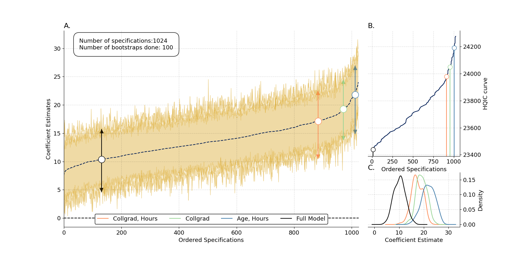

# RobustiPy

A set of packages for a robust, certain and stable model space.
This project is in early stages of development and its functionally and API might change without notice.

# Installation

## From GitHub

To install directly from Github run:

```
git clone https://github.com/RobustiPy/robustipy.git
cd robustipy
pip install .
```

# Usage

In a Python script import OLSRobust class running:
```python
from robustipy.models import OLSRobust

model_robust = OLSRobust(y=y, x=x, data=data)

model_robust.fit(controls=c,
	             draws=100,
                 sample_size=100,
                 replace=True)

model_results = model_robust.get_results()

```
Where `y` is a list of variables names used to create your dependent variable, and `x` is a list of variables names used as predictors.

# Example

A working usage example `replication_example.py` is provided cloning this repository.




@TODO next: implement weighting and selection over the loaded outcome spaces
