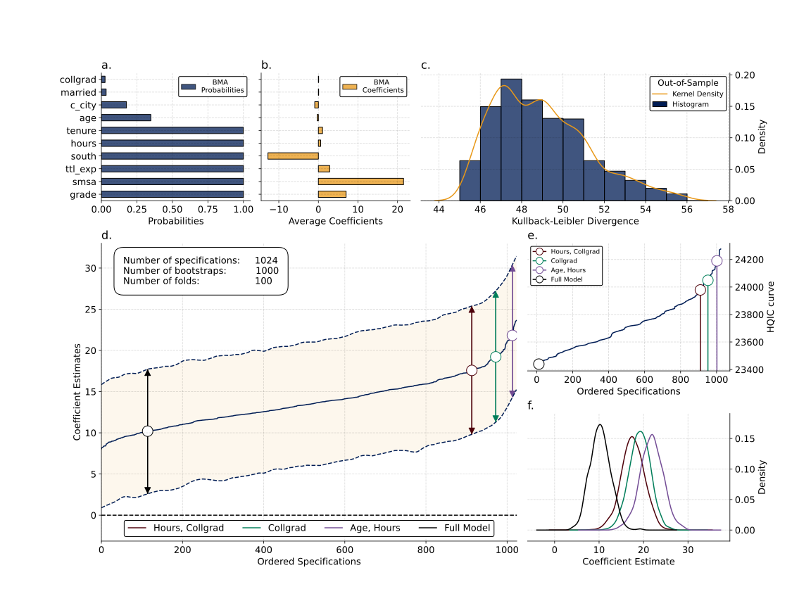

[](https://shields.io/)
[](https://shields.io/)
[](https://shields.io/)

Welcome to the home of `RobustiPy`, a library for the creation of a more robust and stable model space. Kindly note: **this project is in early stages of development and its functionally and API might change without notice**!

`RobustiPy` performs Multiversal/Specification Curve Analysis. Multiversal/Specification Curve Analysis attempts to compute most or all reasonable specification of a statistical model, understanding a specification as a single version of a model, with is particular choice of covariates, hyperparamters, data cleaning decisions, etc.

More formally, lets assume we have model of the form:

$$
y = f(x, \textbf{z}) + \epsilon .
$$

In which we attempt to model a dependent variable $y$ using some kind of function $f()$, some predictor/s $x$ and some covariates $z$, plus some random error $\epsilon$. For all of these elements it is possible to have different versions. Lets assume $y$, $x$ and $z$ are imperfect latent variables or collection of latent variables. Researchers can come up with reasonable operationalisations of $y$, $x$ and $z$, running the analysis ussually in just a few or a single combination of them. Ideally, we should take all those operationalisations and store them in sets:

$$
Y = \{y_{1}, y_{2}, \dots, y_{n}\} \\
X = \{x_{1}, x_{2}, \dots, x_{n}\} \\
Z = \{z_{1}, z_{2}, \dots, z_{n}\}
$$

`RobustiPy` will then:

$$
\Pi = \left\{ \overline{S_i} \mid S_i \in \mathcal{P}(Y) \text{ and } S_i \neq \emptyset \right\} \times X \times \mathcal{P}(Z)
$$

In other words, it will create a set contaning the aritmentic mean of the elements of the powerset $\mathcal{P}$ (all possible combination of any lenght) of $Y$, the set $X$ and the powerset of $Z$, to then produce the cartesian product of these sets, creating the full set of possible model specifications $\Pi$. `RobustiPy` will then take this specifications, fit them in the provided data, and deliver the coeficients for each version of the predictor $x$ in the set $X$.


## Installation

To install directly (in `Python`) from GitHub run:

```
git clone https://github.com/RobustiPy/robustipy.git
cd robustipy
pip install .
```

## Usage

In a Python script (or Jupyter Notebook), import the OLSRobust class running:

```python
from robustipy.models import OLSRobust
model_robust = OLSRobust(y=y, x=x, data=data)
model_robust.fit(controls=c,
	         draws=100,
                 sample_size=100)
model_results = model_robust.get_results()
```
Where `y` is a list of variables names used to create your dependent variable, and `x` is a list of variables names used as predictors.

## Example

A working usage example script -- `replication_example.py` -- is provided at the root of this repository. You can also find a number of empirical examples [here](https://github.com/RobustiPy/Empirical-Examples) and some simulated examples [here](Simulated-Examples).



## Website

We have a shiny website made with `jekkyl-theme-minimal` that you can find [here](https://robustipy.github.io/). It also contains details of a Hackathon!

## Contributing and Code of Conduct

Please kindly see our [guide for contributors](https://github.com/RobustiPy/robustipy/blob/main/contributing.md) file as well as our [code of conduct](https://github.com/RobustiPy/robustipy/blob/main/CODE-OF-CONDUCT.md). If you would like to become a formal project maintainer, please simply contact the team to discuss!

## License

This work is free. You can redistribute it and/or modify it under the terms of the GNU 3.0 license. The two datasets listed above come with their own licensing conditions, and should be treatedly accordingly.

## Acknowledgements
We are grateful to the extensive comments made by various academic communities over the course of our thinking about this work, not least the members of the [ESRC Centre for Care](https://centreforcare.ac.uk/) and the [Leverhulme Centre for Demographic Science](https://demography.ox.ac.uk/).

<div style="display: flex; justify-content: space-between;">
    
    
</div>
